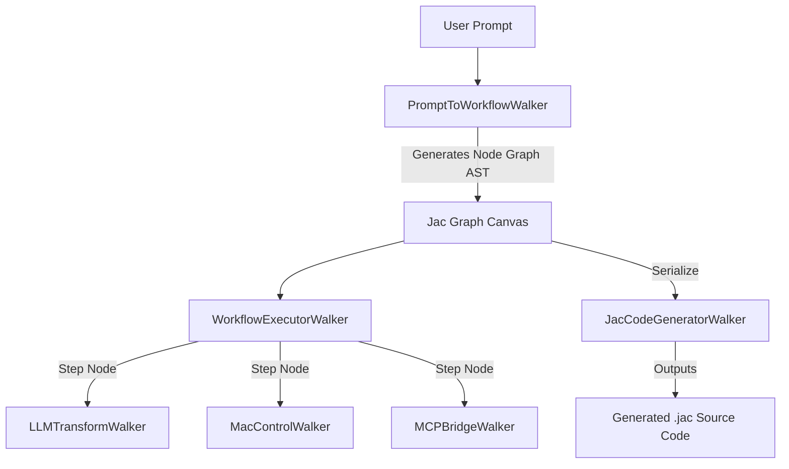

# AGENTS.md — Swirl Agent Architecture & Jaclang Multi-Agent Specification

**Project:** Swirl (JacHacks SF 2026)  
**Language:** Jaclang (`.jac`)  
**Framework:** Jaseci Labs Graph-Walker Multi-Agent Architecture  

---

## 1. Overview of Swirl Agent System

In Swirl, agents are implemented as native **Jac Walkers** operating on a persistent graph of **Jac Nodes**. Unlike conventional workflow engines that use JSON configs or static state machines, Swirl uses Jac's native graph-walker semantics:

1. **Nodes** represent computational steps (Triggers, LLM Transforms, macOS Apps, MCP Tools, Decisions, Outputs).
2. **Edges** represent control flow and data dependencies between steps.
3. **Walkers** represent active agents that spawn, traverse nodes, evaluate conditions, execute local system calls, and record execution trace state.

---

## 2. Core Agent Roles & Jac Walkers



### Agent 1: `PromptToWorkflowWalker` (Intent Translation Agent)
- **Role:** Converts natural language user prompts into a structured node graph representing the Scratch workflow.
- **Jac Primitive:** Uses `can prompt_to_ast(user_prompt: str) -> dict by llm();` to map user intent directly into block schemas.
- **Output:** Instantiates graph nodes (`spawn node_a -> node_b`) and sets visual block coordinates.

### Agent 2: `WorkflowExecutorWalker` (Graph Traversal Agent)
- **Role:** Traverses the visual workflow graph from `StartNode` along directed edges to `EndNode`.
- **Jac Primitive:** `walker WorkflowExecutorWalker { has ctx: dict; with entry { ... } }`
- **Behavior:** Executes each node's capability (`node.execute()`), passes data forward in `ctx`, records state snapshots, and sends WebSocket progress events to the UI.

### Agent 3: `MacControlWalker` (Desktop Automation Agent)
- **Role:** Executes AppleScript commands and macOS system APIs to interact with local Mac applications.
- **Supported macOS Target Apps:**
  - **Finder:** Create folders, move/organize files, query directory contents.
  - **Apple Notes:** Create notes, append text, search notes.
  - **Mail:** Create draft emails, retrieve recent messages.
  - **Calendar:** Add events, list upcoming schedule.
  - **System:** Trigger notifications, adjust volume/brightness, run shell commands.

### Agent 4: `MCPBridgeWalker` (Model Context Protocol Adapter Agent)
- **Role:** Dispatches tool calls to Model Context Protocol (MCP) servers (via stdio or HTTP JSON-RPC).
- **Capability:** Dynamically discovers available MCP tools (`tools/list`), validates tool arguments against JSON schemas, and executes tool calls (`tools/call`).

### Agent 5: `JacCodeGeneratorWalker` (Source Code Compilation Agent)
- **Role:** Compiles the visual node graph into clean, idiomatic, human-readable `.jac` code.
- **Output:** Produces valid `.jac` files containing Jac `node` declarations and `walker` graph execution logic.

---

## 3. Jaclang Code Specifications & Schema Definitions

### Node & Walker Declarations (`workflow_agent.jac`)

```jac
# Core Node Base
node WorkflowBlock {
    has id: str;
    has block_type: str;
    has title: str;
    has config: dict;
    has status: str = "idle";
    has output: dict = {};

    can execute(ctx: dict) -> dict {
        # Base node execution method overriden by specialized block nodes
        return ctx;
    }
}

# Specialized Nodes
node TriggerBlock :WorkflowBlock: {
    can execute(ctx: dict) -> dict {
        print(f"[TriggerBlock] Started: {self.title}");
        self.status = "success";
        return ctx;
    }
}

node LLMTransformBlock :WorkflowBlock: {
    can summarize_text(input_text: str, instruction: str) -> str by llm();

    can execute(ctx: dict) -> dict {
        self.status = "running";
        input_text = ctx.get("text", self.config.get("prompt", ""));
        instruction = self.config.get("instruction", "Summarize concisely");
        result = self.summarize_text(input_text, instruction);
        self.output = {"result": result};
        self.status = "success";
        ctx["text"] = result;
        return ctx;
    }
}

node MacAppBlock :WorkflowBlock: {
    can execute(ctx: dict) -> dict {
        self.status = "running";
        app_name = self.config.get("app", "Notes");
        action = self.config.get("action", "create_note");
        content = ctx.get("text", self.config.get("content", ""));
        
        # Execute macOS AppleScript or Shell Command
        res = exec_mac_action(app_name, action, content);
        self.output = res;
        self.status = "success";
        return ctx;
    }
}

node MCPToolBlock :WorkflowBlock: {
    can execute(ctx: dict) -> dict {
        self.status = "running";
        server_name = self.config.get("server", "local");
        tool_name = self.config.get("tool_name", "fetch_url");
        params = self.config.get("params", {});
        
        res = call_mcp_tool(server_name, tool_name, params);
        self.output = res;
        self.status = "success";
        return ctx;
    }
}

# Main Execution Walker
walker WorkflowExecutorWalker {
    has ctx: dict = {};
    has logs: list = [];

    with entry {
        print("🚀 [WorkflowExecutorWalker] Starting graph traversal...");
        # Traverse graph nodes starting from root
        visit [--sn:WorkflowBlock-->];
    }
}
```

---

## 4. MCP Protocol Integration Architecture

Swirl integrates with MCP servers according to the open Model Context Protocol spec:

1. **Discovery:** When an MCP server is registered (e.g. stdio command `npx -y @modelcontextprotocol/server-filesystem /Users/...`), `MCPBridgeWalker` sends a `tools/list` JSON-RPC request.
2. **Block Generation:** Swirl automatically converts each returned MCP tool signature into a Scratch-style UI block.
3. **Execution:** During workflow run, `MCPToolBlock` invokes `MCPBridgeWalker` which formats parameters into `tools/call` JSON-RPC requests over stdio/HTTP.

---

## 5. Security & Safety Guardrails

- **macOS System Permissions:** Destructive actions (e.g. deleting files in Finder or running terminal commands) trigger a confirmation dialog in the Swirl UI before the `MacControlWalker` executes them.
- **Local First:** All Jac Walkers run locally on the user's Mac, ensuring zero data leakage of desktop contents or private notes.
